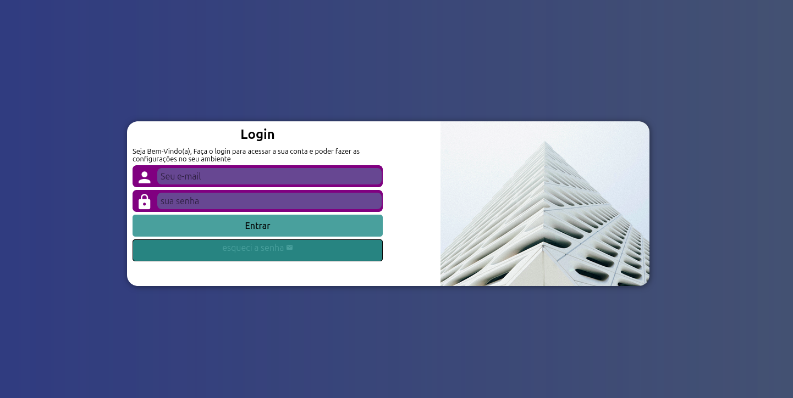

<link rel="stylesheet" href="style-readme.css">

<h1>🌐 Estudos HTML/CSS</h1>

🎯 olá, seja bem vindo(a) ao meu repositório dos meus exercícios e projetos pessoais, explore os projetos criados e estudados durante meu aprendizado

<h1> Projetos Estudados no Canal do Curso em Vídeo </h1>

<h2>📱Projeto Android</h2>

Uma página simples que conta curiosidades sobre o mascote do android

<h2> 📜 Projeto Cordel </h2>

Este projeto mostra um cordel de Milton Duarte que fala sobre temas contemporâneos da tecnologia

<h2> Projeto Login </h2>

é um projeto de um login responsivo para diferentes telas e com transições de animações CSS3

<h2> Projeto Redes Sociais </h2>

é um projeto interativo onde no centro do site há um smartphone e botões de opções de cada rede social, este projeto utiliza de conhecimentos de iframes e navegação de sites com iframes no HTML5

